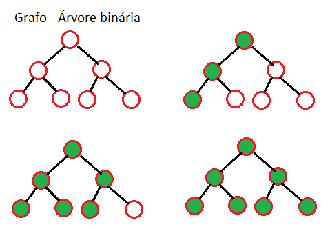

# Condicionais (if) ou (se)
- if(teste lógico){verdadeiro}
- if(teste lógico){verdadeiro} else {falso}
- if(teste lógico){verdadeiro} else if(teste lógico) {verdadeiro} else {falso}
- else = senão

# Árvore binária

# Teste lógico
- (==) igual
- (!=) diferente
- (>) maior
- (<) menor
- (>=) maior ou igual
- (<=) menor ou igual

- && => AND => E
- || => OR => OU
- ! => NOT => NÃO

# Tabela verdade
<table border="0">
	<tr>
		<td>
			<table border="1">
				<tr><td colspan="3">AND</td></tr>
				<tr><td>V</td><td>V</td><td>V</td></tr>
				<tr><td>V</td><td>F</td><td>F</td></tr>
				<tr><td>F</td><td>V</td><td>F</td></tr>
				<tr><td>F</td><td>F</td><td>F</td></tr>
			</table>
		</td>
		<td>
			<table border="1">
				<tr><td colspan="3">OR</td></tr>
				<tr><td>V</td><td>V</td><td>V</td></tr>
				<tr><td>V</td><td>F</td><td>V</td></tr>
				<tr><td>F</td><td>V</td><td>V</td></tr>
				<tr><td>F</td><td>F</td><td>F</td></tr>
			</table>
		</td>
		<td>
			<table border="1">
				<tr><td colspan="2">NOT</td></tr>
				<tr><td>V</td><td>F</td></tr>
				<tr><td>F</td><td>V</td></tr>
			</table>
		</td>
	</tr>
</table>
