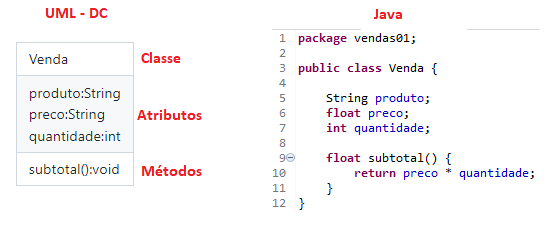
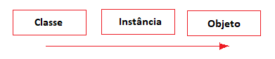
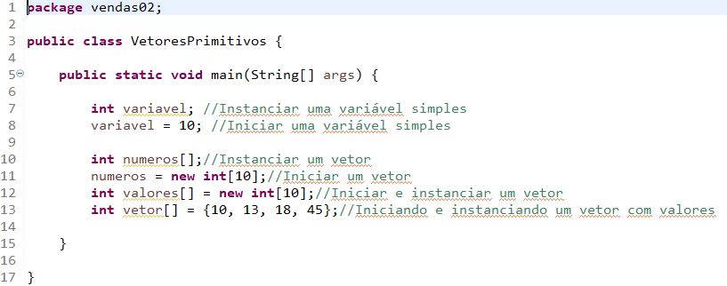
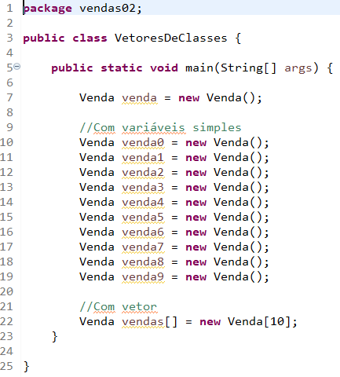

# Java (Exemplo 2 - Projeto Vendas)
- Criar uma pasta chamada "workspace_aula2"
- Abrir o Eclipse e configurar esta pasta como workspace
- Criar um novo projeto "Java Project" chamado <b>Vendas</b>
- Na pasta "src" do seu projeto criar uma nova classe chamada <b>Venda</b> no pacote <b>padrao</b> não marcar a opção "public static void main()"
<table>
	<tr><td border=1>Venda</td><td border=0>Classe</td></tr>
	<tr><td border=1>produto:String preco:String quantidade:int</td><td border=0>Atributos</td></tr>
	<tr><td border=1>subtotal():void</td><td border=0>Métodos</td></tr>
</table>
- Ainda no pacote <b>padrao</b> criar uma classe chamada <b>Main</b> e marcar a opção "public static void main()"
- Ao concluir a demonstração renomear o pacote <b>padrao</b> para <b>vendas01</b>

# Programação Orientada a Objeto
- O início da POO é a <b>Classe</b>:
- 
- Formada pelos ítens:
- Nome da classe iniciando em maiúsculas:
- Atributos que são as características da classe, suas variáveis
- Métodos que são as funções da classe
- 
- A instância é a reserva/ponteiro de memória para um objeto, porém sem dados ainda
- 
- O objeto, em fim é o que podemos utilizar na programação
- existe a partir do comando <b>new</b>

# Java: Vetores
- Como declarar vetores primitivos:
- 
- Como declarar e utilizar vetores de Classes:
- 
