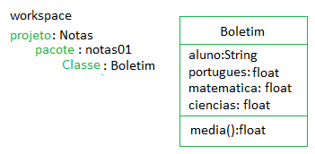
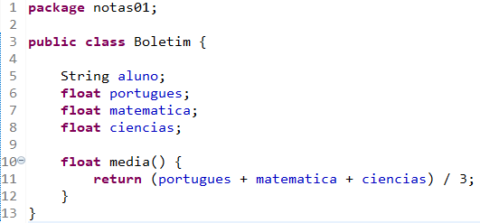
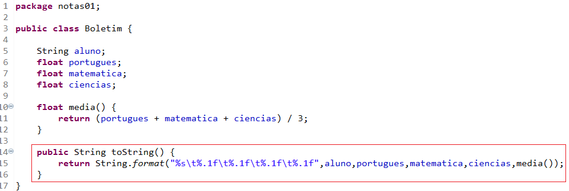
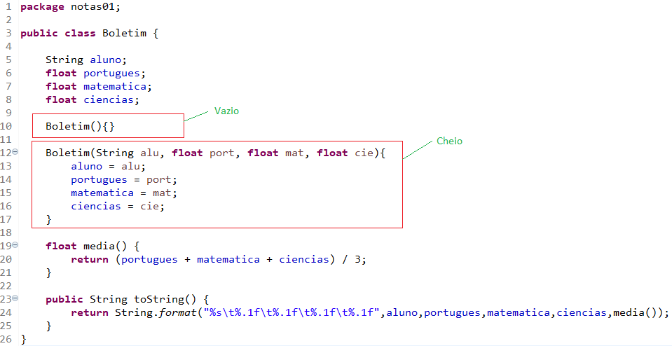
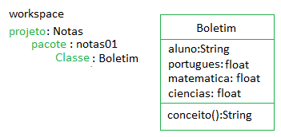
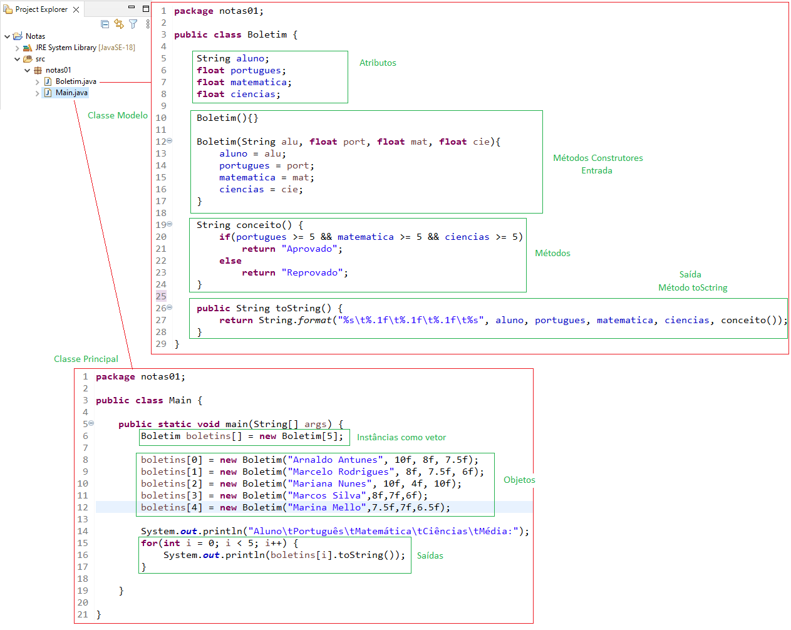
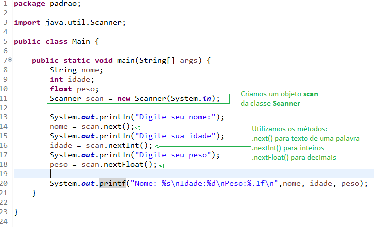
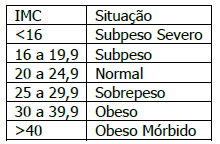

# POO (Programação Orientada a Objeto)
- Classe > Instância > Objeto
- UML (Unified Modeling Language - Linguagem universal de modelagem)
- DC (Diagrama de Classes)

# Atividade
- De acordo com a UML a seguir crie a Classe modelo:
- 
- Crie a classe Main, um vetor com 5 boletins[], preencha 5 Objetos boletins e os mostre em uma tabela.

# Métodos: Construtores() e toScring()
- Classe simples
- 
- Método toString() : é um método comum de <b>Saída</b> onde formatamos os atributos da classe
-  
- Mátodos construtores, servem para iniciar um objeto já com dados, simplificando a <b>Entrada</b>
- 

# Continuação da atividade
- A média entre as disciplinas não faz sentido, por este motivo vamos alterar o método <b>media()</b> para <b>conceito()</b>
- 
- Para ser "Aprovado" o aluno deve ter nota maior ou igual a 5 nas três disciplinas(Português, Matemática e Cinências)
- Senão estará "Reprovado"
- Programa Completo com Construtores:
- 

# Java Classe Scanner
- 

# Atividade 2
- Crie um novo projeto chamado <b>Nutricao</b>
- Crie um pacote chamado <b>programa</b>
- Crie uma classe modelo chamada <b>Paciente</b> conforme o DC, UML a seguir:
- 
- Crie um programa seguindo as regras de negócio a seguir:
	- 1. Deve permitir cadastrar até 10 pacientes:
	- 2. Deve mostrar todos os pacientes cadastrados em uma lista na tela do console, com o imc e diagnóstico:
	- 3. Deve calcular o imc() com a fórmula peso / (altura * altura)
	- 4. Deve traçar o diagnóstico conforme tabela a seguir
	- 
- O programa deve utilizar Construtores, toString() e no método mai() deve utilizar a classe Scanner para ler os dados a partir do usuário:
# Atividade (Análise Estatística)
- Calcule e apresente as médias dos IMCs, pesos e alturas
- Mostre o paciente mais magro
- Mostre o paciente mais obeso
- Mostre o paciente mais alto
- Mostre o paciente mais baixo
- Conte quantos pacientes temos em cada diagnóstico: