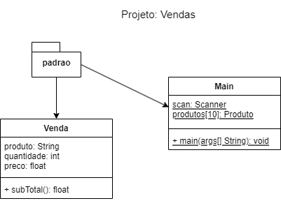

# FPOO x SOP (Orientação a Objetos)
	- Vetores
	- Listas
	- Menus
	- Projeto
		- Pacote
			- Classe > Instância > Objeto
# Atividade (Java x Excel)
	- Crie a seguinte solução orientada a objeto
	- O cliente precisa de uma planilha de vendas onde possa:
		- 1. Calcular os subtotais (preço x quantidade)
		- 2. Calcular o total das vendas
		- 3. Obter a média de preços dos produtos
		- 4. Destacar o produto mais barado.
		- 5. Destacar o produto mais caro.
		- 6. Destacar o produto mais vendido.
# Diagrama de Classes
- 
# Tabela com dados de teste para a planilha e o programa:
<table>
	<tr><th>Produto</th><th>Quantidade</th><td>Preço</th><td>Subtotal()</th></tr>
	<tr><td>Alicate</td><td>5</td><td>15,5</td><td></td></tr>
	<tr><td>Martelo</td><td>3</td><td>25,5</td><td></td></tr>
	<tr><td>Serrote</td><td>2</td><td>35,5</td><td></td></tr>
	<tr><td>Turquesa</td><td>2</td><td>18,0</td><td></td></tr>
	<tr><td>ChaveFenda</td><td>12</td><td>8,99</td><td></td></tr>
	<tr><td>ChaveBoca</td><td>8</td><td>8,99</td><td></td></tr>
	<tr><td>ChavePhilips</td><td>10</td><td>8,99</td><td></td></tr>
	<tr><td>Furadeira</td><td>4</td><td>350,5</td><td></td></tr>
	<tr><td>Lixadeira</td><td>2</td><td>255,9</td><td></td></tr>
	<tr><td>SerraMarmore</td><td>3</td><td>435,5</td><td></td></tr>
</table>