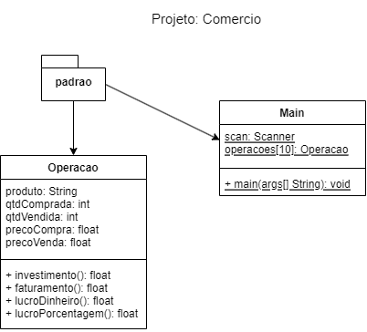

# FPOO x SOP (Orientação a Objetos)
	- Vetores
	- Listas
	- Menus
	- Projeto
		- Pacote
			- Classe > Instância > Objeto
# Atividade 1 (Java x Excel)
- O Sr. Osmar Motta, planeja abrir uma loja de ferramentas.  Para isso fez alguns orçamentos de preços dos produtos que deseja vender
 Também fez estimativas de quantidades de produtos que precisa para iniciar o negócio.
 Para ajudar o Sr. Osmar crie a uma solução orientada a objeto e também uma planilha que mostre as seguintes estatísticas:
	- 1. Calcule os subtotais (preço x quantidade)
	- 2. Calcule o total das vendas
	- 3. Obtenha a média de preços dos produtos
	- 4. Aponte o produto mais barado.
	- 5. Aponte o produto mais caro.
	- 6. Aponte o produto mais vendido.
- Diagrama de Classes:
 
- Tabela com dados de teste para a planilha e o programa:
<table>
	<tr><th>Produto</th><th>Quantidade</th><th>Preço</th><th>Subtotal()</th></tr>
	<tr><td>Alicate</td><td>5</td><td>15,5</td><td></td></tr>
	<tr><td>Martelo</td><td>3</td><td>25,5</td><td></td></tr>
	<tr><td>Serrote</td><td>2</td><td>35,5</td><td></td></tr>
	<tr><td>Turquesa</td><td>2</td><td>18,0</td><td></td></tr>
	<tr><td>ChaveFenda</td><td>12</td><td>8,99</td><td></td></tr>
	<tr><td>ChaveBoca</td><td>8</td><td>8,99</td><td></td></tr>
	<tr><td>ChavePhilips</td><td>10</td><td>8,99</td><td></td></tr>
	<tr><td>Furadeira</td><td>4</td><td>350,5</td><td></td></tr>
	<tr><td>Lixadeira</td><td>2</td><td>255,9</td><td></td></tr>
	<tr><td>SerraMarmore</td><td>3</td><td>435,5</td><td></td></tr>
</table>
# Atividade 2 (Java x Excel)
- Após receber sua ajuda tecnológica, o Sr. Osmar decidiu empreender e abrir o seu comércio
  foi até o Paraguai e comprou muitas mercadorias, porém agora precisa de uma planilha
  para conrolar seus investimentos e saber se terá lucro com os preços que estimou:
	- 1. Calcule o investimento que o sr. Osmar fez em cada compra (precoCompra * qtdComprada)
	- 2. Calcule o faturamento que o sr. Osmar teve em cada venda (precoVenda * qtdVendida)
	- 3. Calcule o

- Diagrama de Classes:
 
- Tabela com dados de teste para a planilha e o programa:
<table>
	<tr><th>Produto</th><th>Quantidade</th><th>Preço</th><th>Subtotal()</th></tr>
	<tr><td>Alicate</td><td>5</td><td>15,5</td><td></td></tr>
	<tr><td>Martelo</td><td>3</td><td>25,5</td><td></td></tr>
	<tr><td>Serrote</td><td>2</td><td>35,5</td><td></td></tr>
	<tr><td>Turquesa</td><td>2</td><td>18,0</td><td></td></tr>
	<tr><td>ChaveFenda</td><td>12</td><td>8,99</td><td></td></tr>
	<tr><td>ChaveBoca</td><td>8</td><td>8,99</td><td></td></tr>
	<tr><td>ChavePhilips</td><td>10</td><td>8,99</td><td></td></tr>
	<tr><td>Furadeira</td><td>4</td><td>350,5</td><td></td></tr>
	<tr><td>Lixadeira</td><td>2</td><td>255,9</td><td></td></tr>
	<tr><td>SerraMarmore</td><td>3</td><td>435,5</td><td></td></tr>
</table>