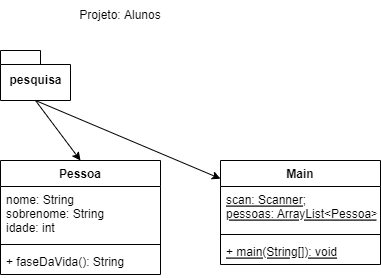
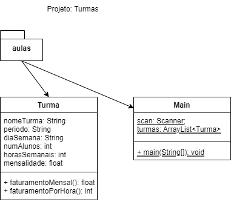

# Atividade 3 (Java x Excel)
- Sra. Ana Rita Silva, empreendedora, morou no Canadá por 5 anos, agora encontra-se em Jaguariúna e pretende abrir uma pequena escola de inglês em um cômodo de sua casa, tembém pretende dar aulas remotas, para analizar a viabilidade deste empreendimento fez uma pesquisa de possíveis interessados em estudar inglês.
- Montou uma planilha com os nomes, sobrenomes e idade dos interessados, e precisa da sua ajuda para:
- Classificar as pessoas interessadas através das fases da vida (Criança, Jovem, Adulto, Idoso)
- Conte quantas pessoas estão em cada fase da vida.
- Qual a média de idade geral dos interessados.
- Qual a média de idade em cada fase da vida.
<table>
<tr><th>Nome</th><th>Sobrenome</th><th>Idade</th><th>faseDaVida</th></tr>
<tr><td>Marcos</td><td>Pereira</td><td>23</td><td></td></tr>
<tr><td>Maria</td><td>Motta</td><td>49</td><td></td></tr>
<tr><td>Ana</td><td>Mattos</td><td>40</td><td></td></tr>
<tr><td>Bruna</td><td>Martim</td><td>11</td><td></td></tr>
<tr><td>Suzana</td><td>Oliveira</td><td>7</td><td></td></tr>
<tr><td>Fernanda</td><td>Motta</td><td>45</td><td></td></tr>
<tr><td>Camila</td><td>Oliveira</td><td>87</td><td></td></tr>
<tr><td>Suelem</td><td>Martim</td><td>71</td><td></td></tr>
<tr><td>Jiovana</td><td>Pereira</td><td>87</td><td></td></tr>
<tr><td>Stephanie</td><td>Mattos</td><td>69</td><td></td></tr>
<tr><td>Isabela</td><td>Oliveira</td><td>63</td><td></td></tr>
</table>
- Diagrama de Classes:

- O programa deve perguntar quantas pessoas interessadas deseja cadastrar.
- Ler os dados da planilha em uma lista (ArrayList)
- Classificar e expor as estatísticas

# Atividade 4 (Java x Excel)
- Após a pesquisa de mercado que a Sra.Ana fez, decidiu abrir as seguintes turmas e matricular os alunos
- Agora ela precisa de uma planilha/programa que faça uma análise financeira para verificar a viabilidade de seu empreendimento com os preços que deseja aplicar.
- Com os dados das turmas montadas calcule:
- O faturamento mensal de cada turma;
- O faturamento por hora;
- O faturamento total mensal;
<table>
<tr><th>nomeTurma</th><th>periodo</th><th>diaSemana</th><th>numAlunos</th><th>horasSemanais</th><th>mensalidade</th><th>faturamentoMensal</th><th>faturamentoHora</th></tr>
<tr><td>criancas01</td><td>manha</td><td>segunda</td><td>1</td><td>2</td><td>149,9</td><td></td><td></td></tr>
<tr><td>adultos01</td><td>noite</td><td>terça</td><td>4</td><td>1</td><td>99,9</td><td></td><td></td></tr>
<tr><td>melhorIdade01</td><td>tarde</td><td>sabado</td><td>3</td><td>2</td><td>129,9</td><td></td><td></td></tr>
<tr><td>melhorIdade02</td><td>tarde</td><td>sexta</td><td>2</td><td>2</td><td>119,9</td><td></td><td></td></tr>
</table>
- Diagrama de Classes:

- O programa deve perguntar quantas turmas deseja cadastrar
- Ler os dados da planilha em uma lista (ArrayList) e mostrar os itens solicitados.