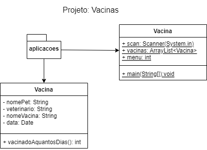

# CRUD
- Cadastro
- Consulta
- Alteração
- Exclusão
# Listas ArrayList<>
- .add(objeto)
- .get(indice)
- .set(indice,objeto)
- .remove(indice)
# Atividade
- Sr. Willian, dono do maior PetShop de Campinas precisa de um sistema para registrar as vacinas dos pets, ele precisa saber o nome do pet(animal), quem aplicou a vacina, qual vacina foi aplicada e quando.
- Inicialmente desenvolva só as funcionalidades em tempo de execução, no futuro os dados deverão ser salvos em uma base de dados (planilha).
- Segue o diagrama de classes.

- O programa principal classe "Main.java" deve conter um menu com as funcionalidades CRUD a seguir
<table>
<tr><td>1. Casastrar Vacina</td><td>Podendo cadastrar uma por vez ou solicitar quantas deseja cadastrar de uma só vez</td></tr>
<tr><td>2. Listar Todas</td><td>Listar todas</td></tr>
<tr><td>3. Alterar Dados</td><td>Solicitar qual o índice do Pet que deseja alterar</td></tr>
<tr><td>4. Excluir Registro</td><td></td>Solicitar qual o índice do Pet que deseja excluir</tr>
<tr><td>5. Buscar por Pet</td><td></td>Solicitar qual o nome do Pet e mostrar somente os seus dados</tr>
<tr><td>6. Buscar por Veterinário</td>Solicitar qual o nome do Veterinário e mostrar somente os seus dados<td></td></tr>
<tr><td>1. Buscar por Vacina</td><td>Solicitar qual o nome da Vacina e mostrar somente os seus dados</td></tr>
</table>