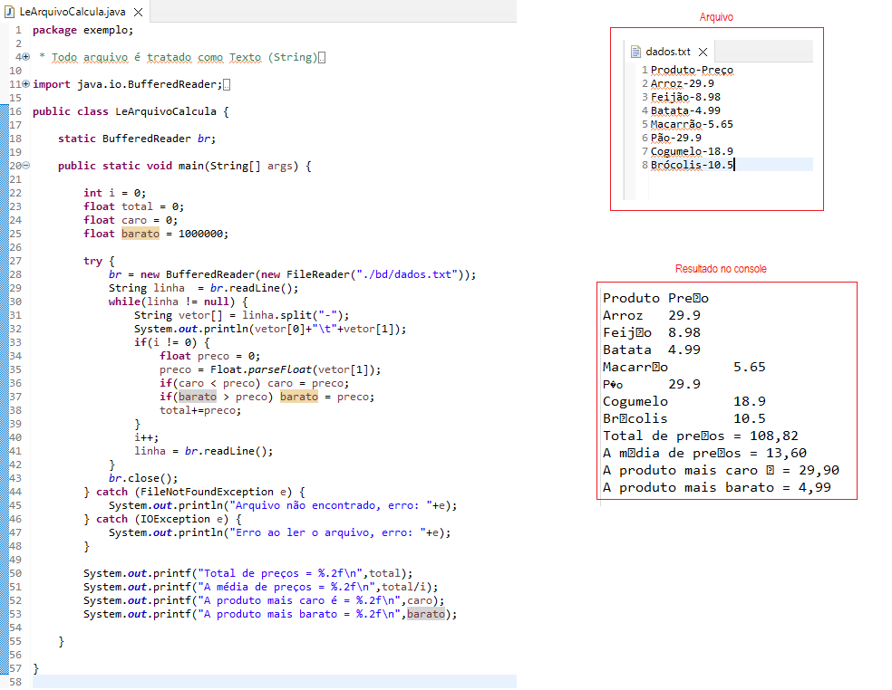

# Manipulação de Arquivos de texto:
- BufferedWriter (Prepara os dados da memória RAM)
- FileWriter (Salva os dados no HD em um arquivo de texto)
- BufferedReader (Carrega os dados na memória RAM)
- FileReader (Lê os dados do arquivo no HD)
- 

# Exercícios - Lista 1
- 1. Faça um programa que receba como entrada o nome e o salário de um funcionário, calcule valor de depósito FGTS e salve em um arquivo "fgts.csv"
- 2. Faça um programa que receba como entrada o nome e o salário de um funcionário, calcule o desconto de INSS e salve em um arquivo "inss.csv"
- 3. Faça um programa que receba como entrada o nome e o salário de um funcionário, calcule o desconto de IRRF e salve em um arquivo "irpf.csv"
- 4. Aproveitando o tema das eleições, visando transparência.
	Faça um programa de urna eletrônica para o segundo turno das eleições, onde o eleitor digite o número do candidado e na tela apareça o nome deste,
	após apareça um menu de confirmação, em caso positivo o voto (numero e nome) deverá ser gravado em um arquivo "eleicao.csv",
	caso negativo deverá solicitar novamente o número do candidato, caso o eleitor coloque um número de candidato que não esteja pré-cadastrado, deverá considerar voto nulo.
	Caso o número digitado seja 0 deverá considerar voto em branco.
	Teste o programa várias vezes para que seja possível uma apuração no excel.

# Lendo arquivos de texto
- Exemplo 

# Exercícios - Lista 2
- 1. Faça um programa que leia o arquivo "dados1.txt" e retorne os dados a seguir na tela do console.
	- A. Mostre no console o seu conteúdo.
	- B. Conte quantas linhas o arquivo possui.
	- C. Em cada linha conte quantas letras esta possui
	- D. Ainda em cada linha conte quantas palavras esta possui
- 2. Faça um programa que leia o arquivo "dados2.csv"  e retorne os dados a seguir na tela do console.
	- A. Mostre no console o seu conteúdo utilizando tabulação "\t"
	- B. Conte quantas linhas o arquivo possui.
	- C. Conte quantas colunas o arquivo possui.
- 3. Faça um programa que leia o arquivo "dados2.csv"  e retorne os dados a seguir na tela do console.
	- A. Mostre no console o seu conteúdo utilizando tabulação "\t"
	- B. Calcule a média de valor dos automóveis
	- C. Mostre a linha que possui o veículo de maior valor.
	- D. Mostre a linha que possui o veículo de menor valor.
	- E. Mostre a linha que possui o veículo de mais novo.
	- F. Mostre a linha que possui o veículo de mais velho.
	- G. Salve todos os dados apresentados na tela em um arquivo "relatorio.txt"
- 4. Faça um programa que leia o arquivo "eleicao.csv" e faça a apuração dos votos na tela do console.
	- A. Mostre quantos votos cada candidato conquistou incluindo Brancos e Nulos.
	- B. Mostre a porcentagem de votos de cada candidato sem contar Brancos e Nulos.
	- C. Mostre a frase: "O candidato XXXX foi eleito em segundo turno com XX% dos votos"
	- D. Salve todos os dados apresentados na tela em um arquivo "apuracao.txt"
- OBS: Os arquivos estão na pasta "Exercicios2/bd"
