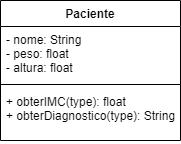
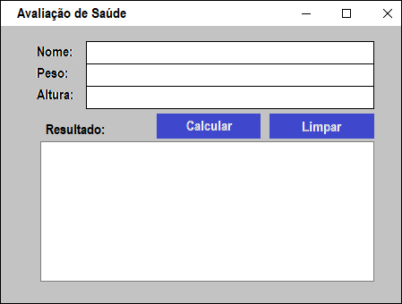
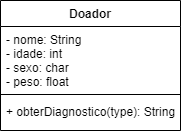
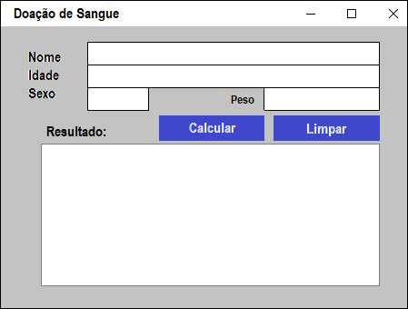
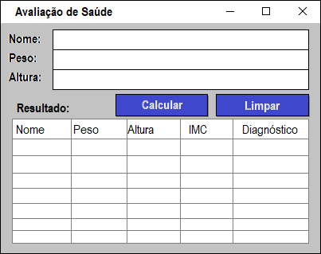
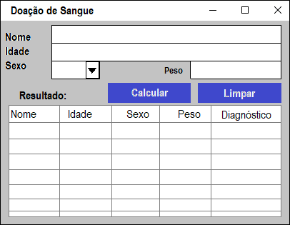
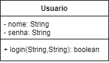
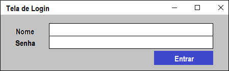

# GUI (Graphics User Interface)
- Tela de interação com usuário
- Bibliotecas
	- JOptionPane (Mensagens de Entrada e Saída)
		- showMessageDialog("Saída")
		- showImputDialog("Entrada")
	- extends JFrame -> Quadro, tela de relacionento com o usuáruio (Formulário),
	- JPanel -> Painel onde colocamos os objetos, semelhante ao CSS quanto a posicionamento em pixels
	- JLabel -> Rótulos, textos expplicativos,
	- JTextField -> Campos de entrada de dados
	- JTextArea -> Area de texto grande (Saída/Entrada).
	- JButon -> Botões de ação
	- implements ActionListener - Ouvir os eventos / clicar no botão
	- Método actionPerformed(evento) -> onde implementamos os códicos dos eventos

# extends (Herança de Classes (Mãe >> Filha))
- No exemplo nossa classe Filha Formulario herda as propriedades da tela JFrame
- Cada filha pode ter apenas uma Mãe
- Caso precise de mais recursos como neste caso precisamos das ações de click nos botões
- Utilizamos implements

# implements (Implementar intrfaces)
- <b>Interfaces</b> são classes que possuem apenas métodos (assinaturas de métodos a serem implementados)
- Neste caso nós implementamos o método actionPerformed() da interface ActionListener que escuta os clicks nos botões
	
# Exemplo (GUI)
- Com a utilização de telas, precisamos também de eventos
- Por isso nossa programação evolui para <b>Orientada a Eventos</b>
- Temos um exemplo com programação Estrutural orientada a evento e um exemplo com POO

# Exemplo (DAO)
- DAO (Data Access Object) Objeto de acesso a dados
- Criamos este objeto para ler e salvar arquivos de texto tipo CSV
- Acessar banco de dados

# Questionário POO
- https://forms.gle/mRTWuvwQwAkxNadTA

# Exercícios
- 1. "Avaliação de Saúde" - Crie um programa orientado a objeto  e interface gráfica. 
O um formulário deve ter os campos nome, peso e altura e ao clicar no botão "Calcular" deve mostrar o IMC do paciente e um diagnóstico: 
Abaixo do peso, Peso normal, Acima do Peso ou Obesidade. 
 
Crie o formulário conforme a imagem
- 2. "Doação de Sangue" - Crie um programa orientado a objeto  e interface gráfica. 
O um formulário deve ter os campos nome, idade e sexo e ao clicar no botão "Calcular" mostrar se o doador está apto ou não a doar 
Conforme os critérios: idade entre 18 e 69 anos e peso acima de 50kg 
 
Crie o formulário conforme a imagem 
- 3. "Acrescentar Funcionalidades" - No projeto "Avaliação de Saúde" Ao clicar no botão Calcular, além de mostrar o resultado na tela, também salve os dados em um arquivo "./bd/pacientes.csv"
- 4. "Acrescentar Funcionalidades" - No projeto "Doação de Sangue" Ao clicar no botão Calcular, além de mostrar o resultado na tela, também salve os dados em um arquivo "./bd/doadores.csv"
- 5. "Acrescentar Funcionalidades" - No projeto "Avaliação de Saúde" Melhore a interface gráfica, colocando os dados de resultado em uma tabela "JTable" 
 
- 6. "Acrescentar Funcionalidades" - No projeto "Doação de Sangue" Melhore a interface gráfica, altere o campo de texto do sexo para um Combo Box com as opções "M" e "F",
coloque os dados de resultado em uma tabela "JTable" 
 
- 7. "Acrescentar Funcionalidades" - No projeto "Avaliação de Saúde" Ao executar o programa os dados do arquivo "./bd/pacientes.csv" devem ser lidos do arquivo e mostrados na tela.
- 8. "Acrescentar Funcionalidades" - No projeto "Doação de Sangue" Ao executar o programa os dados do arquivo "./bd/doadores.csv" devem ser lidos do arquivo e mostrados na tela.
- 9. "Tela de Login" - Crie um programa orientado a objeto  e interface gráfica. 
O formulário deve ter os campos nome e senha  ao clicar no botão "Entrar" deve validar os dados e se estiverem corretos exibir a mensagem "Acesso Pemitido" caso contrário "Acesso Negado" 
 
OBS: O nome do usuário deve ser: admin e a senha 1234 
Utilize a clase JOptionPane para dar as mensagens.
- 10. "Acrescentar Funcionalidades" No projeto "Tela de Login" faça as seguintes modificações:
	- O programa deve permitir que os usuários que estão no arquivo "./usuarios.csv" façam login.
- 11. "Acrescentar Funcionalidades" acrescente a tela de login nos projetos "Avaliação de Saúde" e "Doação de Sangue"
	- Ao executar o programa a tela a ser executada deve ser a de login e caso os dados estejam corretos deve apresentar o formulário do programa.