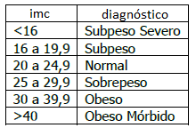

# Excel Atividade Multidisciplinar
- Criar uma planilha conforme instruções de FPOO(aula13) para calcular o IMC(Índice de Massa Corporea) e auxiliar a traçar um Diagnóstico de cada paciente.
- Salvar como: Nutrição.xlsx
<table>
<tr><td>Nome</td><td>Peso</td><td>Altura</td><td>IMC</td><td>Diagnóstico</td></tr>
<tr><td>Jair</td><td>85</td><td>1,83</td><td>25,38146854</td><td>Sobrepeso</td></tr>
<tr><td>Suzana</td><td>44,4</td><td>1,62</td><td>16,91815272</td><td>Subpeso</td></tr>
<tr><td>Marcelo</td><td>76</td><td>2,04</td><td>18,26220684</td><td>Subpeso</td></tr>
<tr><td>Ivone</td><td>78,5</td><td>1,81</td><td>23,96141754</td><td>Normal</td></tr>
<tr><td>Maria</td><td>55</td><td>1,57</td><td>22,31327843</td><td>Normal</td></tr>
<tr><td>Marcelo</td><td>125,5</td><td>1,88</td><td>35,50814848</td><td>Obeso</td></tr>
</table>
- Calcular o <b>IMC</b> com a fórmula: peso/(altura^2)
- E utilizando função SE() fazer o diagnóstico 

- Solução: =SE(D2<16;"Subpeso severo";SE(D2<20;"Subpeso";SE(D2<25;"Normal";SE(D2<30;"Sobrepeso";SE(D2<40;"Obeso";"Obeso Mórbido")))))
- Fazer uma Análise Estatítica dos dados:
	- Contar - Função: cont.num()
	- Somar - Função: soma()
	- Calcular a Média: Função Média()
	- Encontrar os mais pesados, mais altos
	- Encontrar os mais leves, mais baixos
	- Contar cada um dos possíveis diagnósticos: quantos obesos, normais, sub pesos, etc.
- Salvar e imprimir a planilha como um relatório para um(a) Nutricionista e/ou Endocrinologista
	