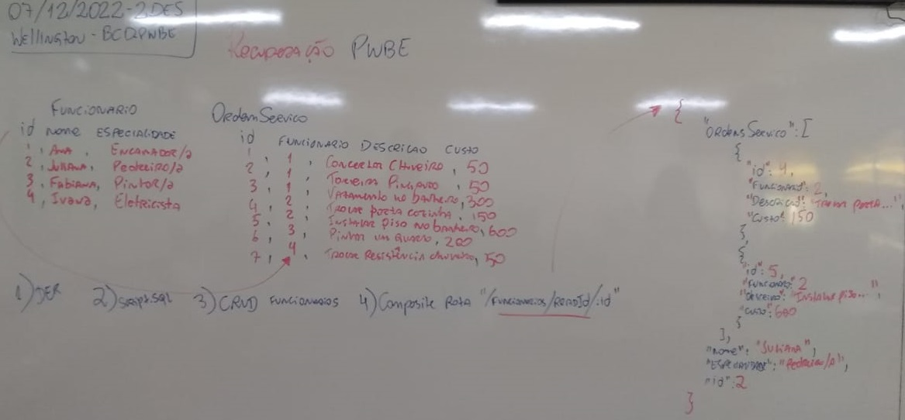

# Atividade Prática de Recuperação
- 
- Entregar em um repositório publico do git até 08/12/2022 as 11:30
	- pasta "docs" com:
		- script.sql "Não precisa arquivos CSV, pode ser "INSERT INTO"
		- DER em formato de imagem
		- Arquivo de testes do Insomnia
	- pasta "back" com:
		- CRUD da tabela de Funcionários
		- Uma rota "/funcionarios/readid/:id" trazendo um COMPOSITE de Funcionario + OrdensServico